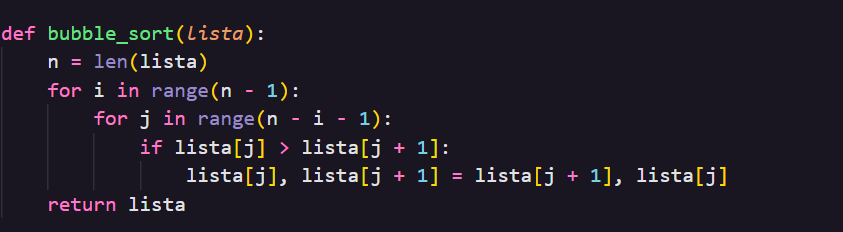
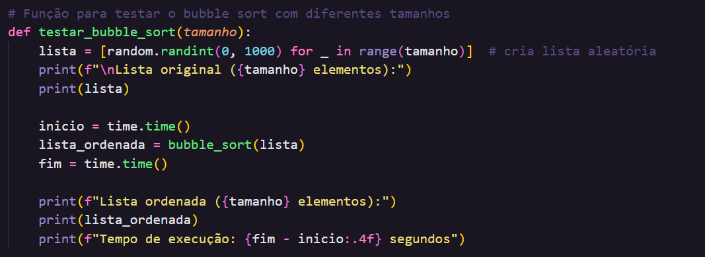
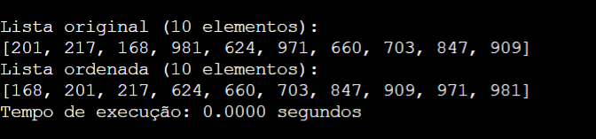
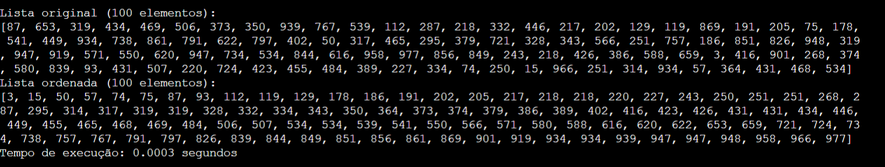
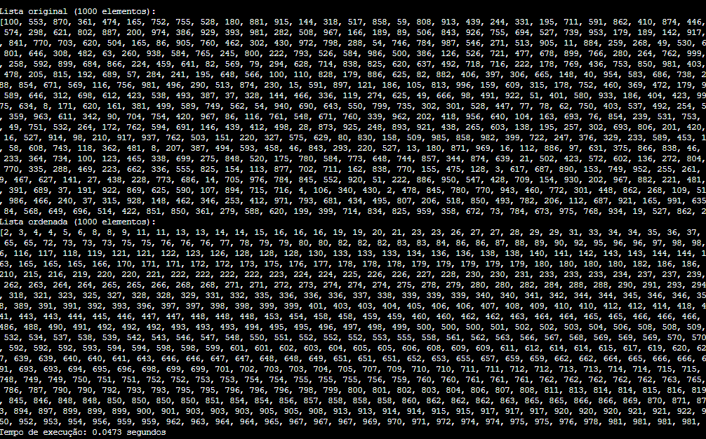

# 🟦 Bubble Sort em Python

Implementação do **algoritmo Bubble Sort** em Python, incluindo função de teste com listas aleatórias e medição de tempo de execução.

---

## 📌 Descrição

O **Bubble Sort** é um algoritmo de ordenação simples que compara elementos adjacentes e os troca de posição se estiverem na ordem errada.  
Este projeto inclui uma função que:

- Gera listas aleatórias de diferentes tamanhos.
- Mostra a lista original e a lista ordenada.
- Mostra o tempo de execução do algoritmo.

---

## ⚡ Funcionalidades

- Ordenação de listas de inteiros.
- 
  
  
- Testes automáticos com tamanhos diferentes: 10, 100, 1000 elementos.
- Medição do tempo de execução do algoritmo.
- 
  
  

---

## 🚀 Testes 
### Teste com 10 elementos:
* Tempo de execução : 0.0000 segundos
  
  

### Teste com 100 elementos:
* Tempo de execução : 0.0003 segundos
  
  

### Teste com 1000 elementos:
* Tempo de execução : 0.0473 segundos
  
  

  ## Conclusão

  O Bubble Sort simples é um algoritmo de ordenação fácil de entender e implementar, mas pouco eficiente. Ele sempre percorre toda a lista em todas as suas passagens, mesmo que os elementos já estejam 
  ordenados antes do final. Isso faz com que ele realize muitas comparações e trocas desnecessárias, resultando em um desempenho lento para listas grandes.

  👉 Em resumo: é um método válido para aprendizado e pequenos conjuntos de dados, mas não é prático para ordenar listas maiores devido ao seu tempo de execução elevado.
